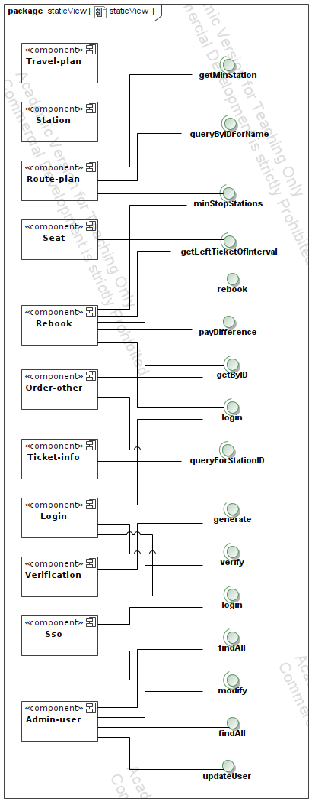
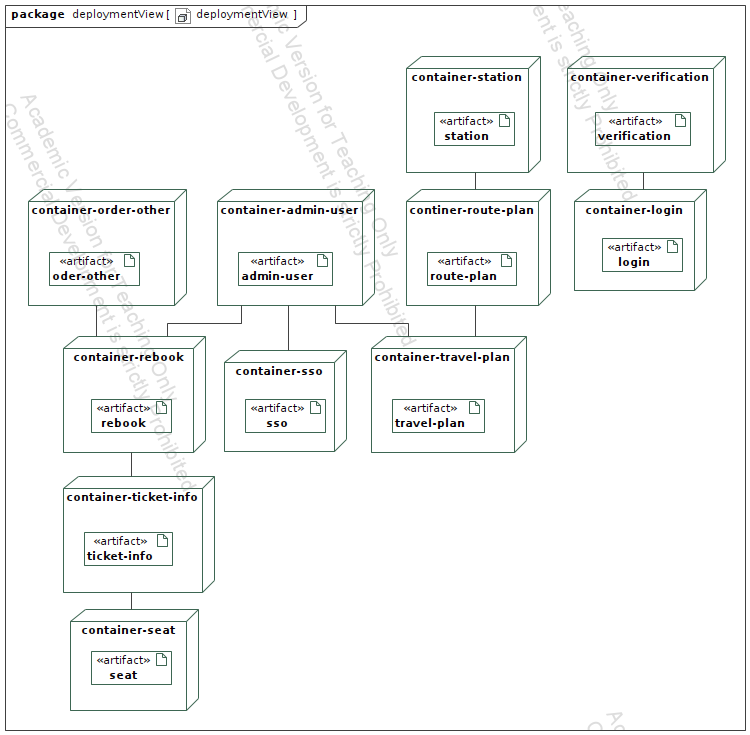
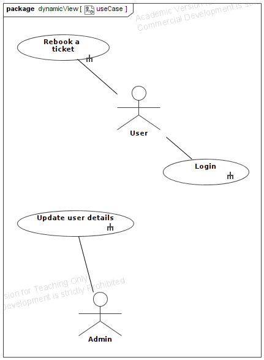
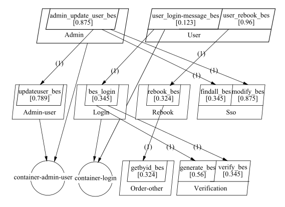

# On the impact of Performance Antipatterns in multi-objective software model refactoring optimization -- Case Study

The static, deployment, and use cases diagram are reported in the following.

The LQN model is reported below

