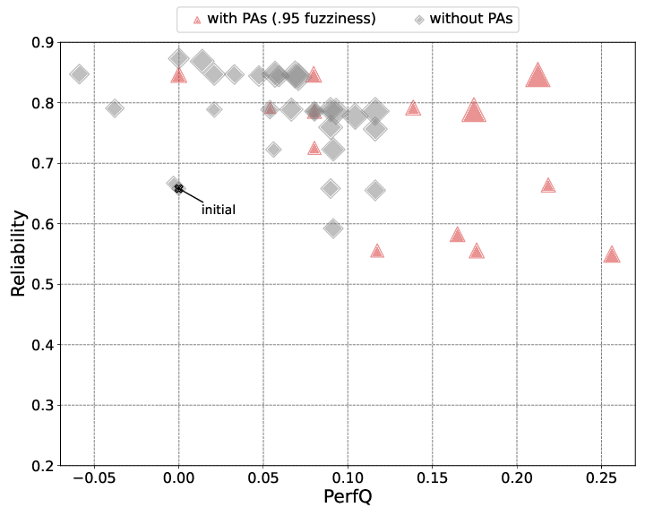
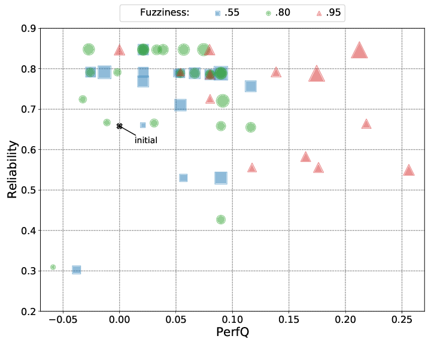

# On the impact of Performance Antipatterns in multi-objective software model refactoring optimization -- Data

Here below the plots used in the paper have been reported.

There is a sub-folder for each experiment in which reference Pareto frontier files have been reported.
